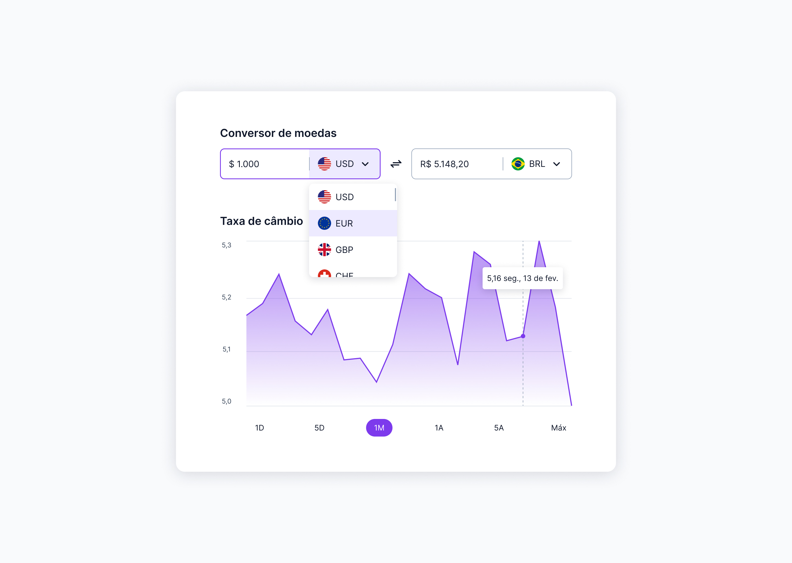

<h1> Conversor de moedas </h1>

 

<h2> O Projeto </h2>

O projeto foi desenvolvido durante os desafios do #BoraCodar. O #boraCodar são desafios semanais, promovido pela Rocketseat para ensino de tecnologias WEB. 

O desafio foi a criação de uma Landing Page de um conversor de moedas.  

  

 

Quer conferir como ficou o conversor?

[Visite o projeto online](https://eltonprado.github.io/BoraCodar09_Desafio09_ConversorDeMoedas/)

 

<h2> O intuito do projeto </h2>

O intuito do projeto foi colocar em prática os conhecimentos acerca de:

### CSS

- outline
- overflow
- box-shadow
- position: relative / absolute
- margin-top: auto
- place-content / align-self / justify-items / justify-content
- centralizar div com position/grid/flex/margin
- ::before / ::after
- :focus
- transform 
- responsividade / mobile first / @media
- linear-gradient()

 

<h2> Tecnologias </h2>

Foi utilizado as seguintes tecnologias para desenvolver esse projeto:

- HTML
- CSS
- JavaScript
- figma
- Git
- GitHub
- https://apexcharts.com/
